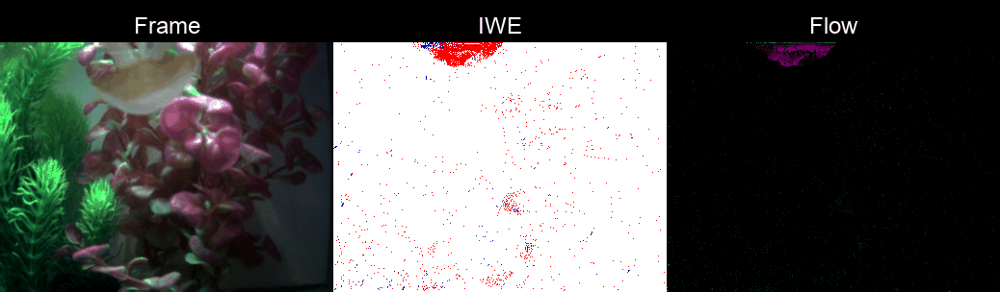
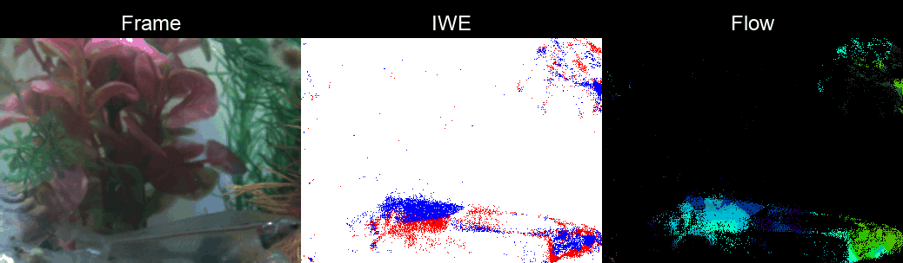

# Overview

This repo provides the code of [Aquatic Neuromorphic Optical Flow](https://arxiv.org/abs/2605.07653).

```
@article{zhang2026aquatic,
  title    = {Aquatic Neuromorphic Optical Flow},
  author   = {Pei Zhang and Yunkai Liang and Kaiqiang Wang},
  journal  = {arXiv preprint arXiv:2605.07653},
  year     = {2026}
}
```

# Demo






# Implementation
This work is under review. Codes will be released upon publication.
